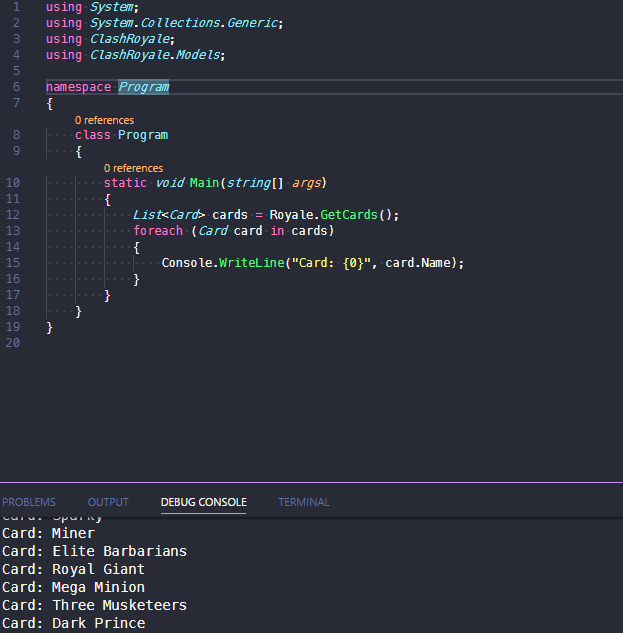

# Clash Royale

Get all info about clash royale cards, loot, leagues and player levels.

This is a wrapper for the awesome NodeJS Clash Royale api made by [Martin Carrera](https://github.com/martincarrera/clash-royale-api).

#### Motivation
The need to use this library in any dotnet core application.

#### Usage

Install using your favorite package manager:

- `PM> Install-Package ClashRoyale -Version 1.0.1`
- `$ dotnet add package ClashRoyale --version 1.0.1`
- `$ paket add ClashRoyale --version 1.0.1`

**Models**:

`Arena`
`Card`
`Chest`
`League`
`Player`

**Available methods:**

*Requirements*
```csharp
using ClashRoyale;
using ClashRoyale.Models;
```

*Cards:*
```csharp
// Returns all cards
List<Card> cards = Royale.GetCards();

// Returns a single card - Id name or id
Card card = Royale.GetCard("fireball");

// Returns the card image url
string imageUrl = Royale.GetCardImageURL(idName);
```

*Arenas:*
```csharp
// Returns all arenas
List<Arena> arenas = Royale.GetArenas();

// Returns a single arena - id or idname
Arena arena = Royale.GetArena(id);

// Returns the arena image url
string arena url = Royale.GetArenaImageURL(idName);
```

*Chests:*
```csharp
// Returns all chests
List<Chest> chests = Royale.GetChests();

// Returns a single chest
Chest chest = Royale.GetChest(id);

// Returns the chest image url
string chestImageUrl = Royale.GetChestURL(idName);
```

*Leagues:*
```csharp
// Returns all leagues
List<League> leagues = Royale.GetLeagues();

// Returns a single league
League league = Royale.GetLeague(id);

// Returns the league image
string leagueImageUrl = Royale.GetLeagueImageURL(idName);
```

*Player info:*
```csharp
// Returns all info about players
List<Players> players = Royale.GetPlayers();

// Returns info about a single player level
Player player = Royale.GetPlayer(id);
```


*And more examples:*

```csharp
// Getting all the cards
List<Card> cards = Royale.GetCards();
foreach (Card card in cards)
{
    Console.WriteLine(card.Name);
}
````

```csharp
// Getting a random deck
List<Card> randomDeck = Royale.GetRandomDeck();
```

Explore model properties:

;

#### TODO
- Better error handling.
- General refactor.
- ~~Improve documentation.~~
- ~~Publish package.~~ - Available @ [Nuget](https://www.nuget.org/packages/ClashRoyale/)


#### License
[MIT - André Varandas](LICENSE.txt)

#### Important Notice
This content is not affiliated with, endorsed, sponsored, or specifically approved by Supercell and Supercell is not responsible for it. For more information see Supercell's Fan Content Policy: [www.supercell.com/fan-content-policy](http://www.supercell.com/fan-content-policy).
